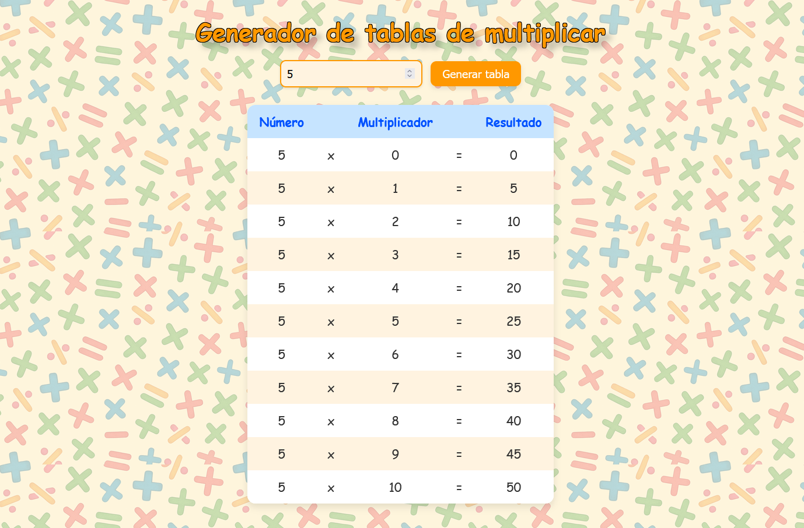

# Generador de Tablas de Multiplicar

Esta pequeña aplicación web genera las tablas de multiplicar de los números entre el 0 y el 10. Está diseñada con un estilo **infantil, colorido y divertido**, ideal para niños que están aprendiendo matemáticas.



## Descripción

-   Introducir un número y generar automáticamente su tabla de multiplicar del 0 al 10.
-   Estilo visual amigable para niños con colores vivos y fuente divertida.
-   Fondo con patrón matemático personalizado.
-   Tabla con bordes redondeados y filas alternadas para mejorar la legibilidad.
-   Validación simple para asegurar que el usuario ingrese un número válido.

## Tecnologías utilizadas

-   HTML5
-   CSS3
-   JavaScript puro

## Uso

1. Clona este repositorio:
    ```bash
    git clone https://github.com/Maialen45/generador-tablas-multiplicar.git
    ```
2. Abre `index.html` con cualquier navegador para ver el sitio web.
3. Introducir un número en el campo de texto.
4. Pulsar el botón **"Generar tabla"**.
5. La tabla aparecerá justo debajo.
